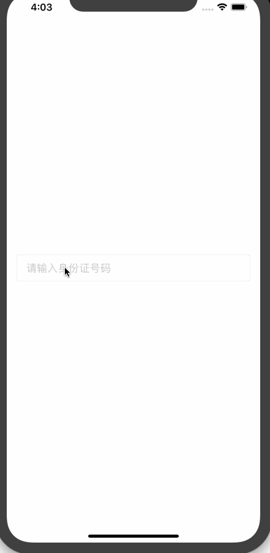

# 身份证输入文本框数字键盘
##备注： 需要第三方库  ``` pod 'PinLayout' ``` 支持布局

1-> 支持cocoapods拉取 使用 ``` pod 'HBIDCardInputKeyBoardTF' ```

2 -> 支持设置编辑文本框的时候文字与文本框的间距，通过以下属性设置

``` 
 /// 编辑文本框文字显示与textfiled的间距
    var editTextMargin: CGFloat = 30.0 {
        didSet {
            setNeedsDisplay()
        }
    }

```

3 -> 支持block回调实时获取文本输入文字：

```
   textField.inputIdCardHandler = { pwd in
            print("pwd = \(pwd)")
      }
```

4 -> 使用案例如下:

```
        let textField = HBIDCardInputKeyBoardTF()
        textField.placeholder = "请输入身份证号码"
        view.addSubview(textField)
        textField.borderStyle = .roundedRect
        textField.editTextMargin = 16
        textField.pin.left(16).right(16).height(44).vCenter()
        textField.inputIdCardHandler = { pwd in
            print("pwd = \(pwd)")
        }

```
5 ->效果图:



